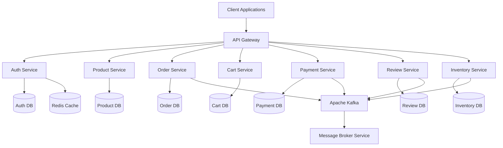

# 🛍️ E-commerce Microservices Platform

[](https://golang.org/)
[](https://www.docker.com/)
[](LICENSE)
[](https://grpc.io/)
[](https://kafka.apache.org/)
[](https://go.dev/ref/mod#workspaces)
[](https://microservices.io/)

A production-ready, scalable e-commerce platform built with microservices architecture using Go, gRPC, and Apache Kafka. Designed for high performance, reliability, and maintainability.


## 🚀 Quick Start

### One-Click Docker Setup

```bash
# Clone the repository
git clone https://github.com/geoo115/E-commerceMicroservices.git
cd E-commerceMicroservices

# Start all services with Docker Compose
docker-compose up --build -d

# Wait for services to initialize (~2-3 minutes)
docker-compose logs -f api-gateway  # Monitor startup
```

### Go Workspace Development Setup

```bash
# Prerequisites: Go 1.24+, Docker, PostgreSQL, Redis, Kafka

# 1. Setup Go workspace
go work init
go work use ./api-gateway ./auth-service ./cart-service \
           ./inventory-service ./message-broker ./order-service \
           ./payment-service ./product-service ./review-service

# 2. Install dependencies
go mod download

# 3. Configure environment
cp .env.example .env
# Edit .env with your database credentials

# 4. Start infrastructure
docker-compose up -d postgres redis kafka

# 5. Run services individually
cd auth-service && go run main.go &
cd api-gateway && go run main.go &
# ... repeat for other services
```

### Health Check

```bash
# Verify all services are running
curl http://localhost:8080/health

# Check individual services
curl http://localhost:50051/health  # Auth Service
curl http://localhost:50052/health  # Product Service
```

**🌐 Access Points:**
* **API Gateway**: `http://localhost:8080` - Main application entry
* **Grafana Dashboard**: `http://localhost:3000` - Metrics visualization
* **Kafka UI**: `http://localhost:8081` - Message broker management  
* **Jaeger UI**: `http://localhost:16686` - Distributed tracing
* **PostgreSQL**: `localhost:5432` - Database access
* **Redis**: `localhost:6379` - Cache management

## 📋 Table of Contents

- [✨ Features](#-features)
- [🏗️ Architecture](#️-architecture)
  - [High-Level Architecture](#high-level-architecture)
  - [Data Architecture](#data-architecture)
  - [Go Workspace Structure](#go-workspace-structure)
  - [Component Flow](#component-flow)
  - [Key Workflows](#key-workflows)
- [🛠️ Services](#️-services)
  - [Service Overview](#service-overview)
  - [Service Dependencies](#service-dependencies)
  - [Service Communication Patterns](#service-communication-patterns)
- [💻 Tech Stack](#-tech-stack)
  - [Core Technologies](#-core-technologies)
  - [Web & API Framework](#-web--api-framework)
  - [Data & Persistence](#️-data--persistence)
  - [Infrastructure & DevOps](#-infrastructure--devops)
  - [Development & Testing](#-development--testing)
  - [Monitoring & Observability](#-monitoring--observability)
  - [Security & Authentication](#-security--authentication)
  - [Performance Features](#-performance-features)
- [🔌 API Endpoints](#-api-endpoints)
  - [Authentication Service](#-authentication-service-port-8080)
  - [Product Service](#-product-service)
  - [Cart Service](#-cart-service)
  - [Order Service](#-order-service)
  - [Payment Service](#-payment-service)
  - [Review Service](#-review-service)
  - [Inventory Service](#-inventory-service)
- [🚀 Getting Started](#-getting-started)  
- [📚 Service Documentation](#-service-documentation)
- [🔧 Development](#️-development)
- [📊 Monitoring](#-monitoring)
- [🤝 Contributing](#-contributing)
- [📄 License](#-license)

## ✨ Features

### 🔐 Security & Authentication
- **JWT Authentication** - Stateless token-based auth with refresh tokens
- **Role-Based Access Control (RBAC)** - Granular permission management
- **API Rate Limiting** - Request throttling and abuse prevention
- **Session Management** - Redis-backed session storage
- **Password Security** - bcrypt hashing with salt rounds

### 🛒 Core E-commerce Functionality
- **Product Catalog** - CRUD operations, categories, search, filtering
- **Order Management** - Complete order lifecycle with status tracking
- **Shopping Cart** - Persistent cart with Redis caching
- **Payment Processing** - Multi-gateway support with transaction tracking
- **Inventory Control** - Real-time stock updates with low-stock alerts
- **Review System** - User reviews and ratings with aggregation

### 📦 Infrastructure & Architecture
- **Microservices Architecture** - Domain-driven service boundaries
- **gRPC Communication** - High-performance inter-service communication
- **Event-Driven Messaging** - Apache Kafka for async operations
- **Database Per Service** - PostgreSQL with service isolation
- **Caching Strategy** - Redis for performance optimization
- **Container Ready** - Docker containers with Docker Compose
- **Go Workspace** - Modern Go 1.24+ workspace configuration

### 🚀 Performance & Scalability
- **Horizontal Scaling** - Stateless services with load balancing
- **Database Connection Pooling** - Optimized connection management
- **Redis Caching** - Strategic caching for frequently accessed data
- **Background Processing** - Async task handling with Kafka consumers
- **Resource Monitoring** - Prometheus metrics collection ready

### 🔧 Developer Experience
- **Comprehensive Documentation** - Detailed README for each service
- **Protocol Buffers** - Strongly-typed API contracts
- **Testing Suite** - Unit tests for all services
- **Hot Reload** - Development-friendly configuration
- **Structured Logging** - Consistent logging across services

## 🏗️ Architecture

### High-Level Architecture
```
                                   ┌─────────────────┐
                                   │   Load Balancer │
                                   └─────────┬───────┘
                                             │
                                   ┌─────────▼───────┐
                                   │   API Gateway   │
                                   │   (Port 8080)   │
                                   └─────────┬───────┘
                                             │
                         ┌───────────────────┼───────────────────┐
                         │                   │                   │
              ┌──────────▼─────────┐ ┌──────▼──────┐ ┌─────────▼────────┐
              │   Auth Service     │ │Product Svc  │ │  Order Service   │
              │   (Port 50051)     │ │(Port 50052) │ │  (Port 50053)    │
              └──────────┬─────────┘ └──────┬──────┘ └─────────┬────────┘
                         │                  │                  │
              ┌──────────▼─────────┐ ┌──────▼──────┐ ┌─────────▼────────┐
              │   Cart Service     │ │Payment Svc  │ │ Inventory Service│
              │   (Port 50054)     │ │(Port 50055) │ │  (Port 50057)    │
              └────────────────────┘ └─────────────┘ └──────────────────┘
                         │                  │                  │
                         └──────────────────┼──────────────────┘
                                            │
                                   ┌────────▼────────┐
                                   │ Message Broker  │
                                   │ (Apache Kafka)  │
                                   └─────────────────┘
```

### Data Architecture
```
┌─────────────────┐    ┌─────────────────┐    ┌─────────────────┐
│   PostgreSQL    │    │      Redis      │    │   Apache Kafka  │
│                 │    │                 │    │                 │
│ ┌─────────────┐ │    │ ┌─────────────┐ │    │ ┌─────────────┐ │
│ │ Auth DB     │ │    │ │ Session     │ │    │ │ order_placed│ │
│ │ Product DB  │ │    │ │ Cache       │ │    │ │ payment_ok  │ │
│ │ Order DB    │ │    │ │ Cart Data   │ │    │ │ inventory   │ │
│ │ Payment DB  │ │    │ │ Product     │ │    │ │ reviews     │ │
│ │ Review DB   │ │    │ │ Cache       │ │    │ │ notifications│ │
│ │ Inventory   │ │    │ └─────────────┘ │    │ └─────────────┘ │
│ └─────────────┘ │    └─────────────────┘    └─────────────────┘
└─────────────────┘                            
```

### Go Workspace Structure
```
📁 E-commerceMicroservices/
│
├── go.work                  # Go workspace configuration
├── docker-compose.yml       # Multi-service orchestration
├── init.sql                # Database initialization
│
├── api-gateway/            # 🌐 HTTP/REST to gRPC Gateway
│   ├── main.go
│   ├── handlers/           # REST endpoint handlers
│   ├── router/            # Route definitions
│   ├── middlewares/       # Auth, logging, CORS
│   ├── config.yaml        # Service configuration
│   ├── Dockerfile
│   └── README.md          # Detailed service docs
│
├── auth-service/          # 🔐 Authentication & Authorization
│   ├── main.go
│   ├── proto/            # gRPC definitions
│   ├── services/         # Business logic
│   ├── models/           # User, Address models
│   ├── utils/            # JWT, hashing utilities
│   ├── db/               # Database connection
│   ├── cache/            # Redis integration
│   ├── tests/            # Unit & integration tests
│   ├── Dockerfile
│   └── README.md
│
├── product-service/       # 📦 Product Catalog Management
├── order-service/         # 📋 Order Processing & Lifecycle
├── cart-service/          # 🛒 Shopping Cart Management
├── payment-service/       # 💳 Payment Processing
├── inventory-service/     # 📊 Stock & Inventory Tracking
├── review-service/        # ⭐ Reviews & Ratings
└── message-broker/        # 🔔 Event-Driven Messaging
```
### Component Flow


### Key Workflows

1. **Authentication Flow**
   ```
   Client → API Gateway → Auth Service → PostgreSQL
   ```

2. **Order Processing**
   ```
   Client → API Gateway → Order Service → (Inventory, Payment) → Kafka
   ```

3. **Real-time Updates**
   ```
   Kafka → [Inventory Service, Notification Service] → Client
   ```

## 🛠️ Services

### Service Overview

| Service | Description | Key Features | Technology Stack | Port | Status |
|---------|-------------|--------------|------------------|------|--------|
| 🌐 **API Gateway** | Entry point & HTTP-gRPC bridge | REST API, Auth, Rate Limiting | Gin, gRPC clients | 8080 | ✅ Active |
| 🔐 **Auth Service** | Authentication & authorization | JWT, RBAC, Session management | gRPC, JWT, PostgreSQL, Redis | 50051 | ✅ Active |
| 📦 **Product Service** | Product catalog management | CRUD, Search, Categories | gRPC, PostgreSQL, Redis | 50052 | ✅ Active |
| 📋 **Order Service** | Order processing & lifecycle | Order management, Status tracking | gRPC, PostgreSQL, Kafka | 50053 | ✅ Active |
| 🛒 **Cart Service** | Shopping cart management | Add/Remove items, Persistence | gRPC, Redis, PostgreSQL | 50054 | ✅ Active |
| 💳 **Payment Service** | Payment processing | Multi-gateway, Transactions | gRPC, PostgreSQL, Kafka | 50055 | ✅ Active |
| ⭐ **Review Service** | Reviews & ratings | CRUD reviews, Rating aggregation | gRPC, PostgreSQL, Kafka | 50056 | ✅ Active |
| 📊 **Inventory Service** | Stock & inventory tracking | Real-time updates, Low-stock alerts | gRPC, PostgreSQL, Kafka | 50057 | ✅ Active |
| 🔔 **Message Broker** | Event-driven messaging | Topic management, Event routing | Kafka, Go consumers/producers | - | ✅ Active |

### Service Dependencies



### Service Communication Patterns

| Pattern | Usage | Services Involved | Protocol |
|---------|-------|-------------------|----------|
| **Synchronous** | Real-time data requests | API Gateway ↔ All Services | gRPC |
| **Asynchronous** | Event notifications | Order → Inventory, Payment | Kafka |
| **Request-Reply** | User authentication | API Gateway → Auth Service | gRPC |
| **Publish-Subscribe** | Order events | Order Service → Multiple consumers | Kafka |
| **Cache-Aside** | Performance optimization | Product, Auth services | Redis |

## 💻 Tech Stack

### 🔧 Core Technologies

| Technology | Version | Purpose | Features |
|------------|---------|---------|----------|
| **Go** | 1.24+ | Primary Language | High performance, concurrency, type safety |
| **gRPC** | Latest | Service Communication | High-performance RPC, Protocol Buffers |
| **PostgreSQL** | 15+ | Primary Database | ACID compliance, advanced SQL features |
| **Apache Kafka** | 3.6+ | Message Broker | Event streaming, high throughput |
| **Redis** | 7+ | Caching & Sessions | In-memory, pub/sub, persistence |

### 🌐 Web & API Framework

| Component | Technology | Purpose |
|-----------|------------|---------|
| **HTTP Router** | Gin | REST API endpoints, middleware |
| **Protocol Buffers** | protobuf | API contracts, serialization |
| **JWT** | golang-jwt | Authentication tokens |
| **CORS** | gin-cors | Cross-origin resource sharing |
| **Rate Limiting** | gin-limiter | API throttling |

### 🗄️ Data & Persistence

| Layer | Technology | Purpose |
|-------|------------|---------|
| **ORM** | GORM | Database abstraction, migrations |
| **Connection Pooling** | pgxpool | Database connection management |
| **Caching Strategy** | Redis | Session storage, query caching |
| **Event Store** | Kafka Topics | Event sourcing, audit trails |
| **Search** | PostgreSQL FTS | Full-text search capabilities |

### 🐳 Infrastructure & DevOps

| Category | Tools | Purpose |
|----------|-------|---------|
| **Containerization** | Docker, Docker Compose | Service isolation, deployment |
| **Orchestration** | Kubernetes (optional) | Container orchestration |
| **Monitoring** | Prometheus, Grafana | Metrics collection, visualization |
| **Tracing** | Jaeger | Distributed request tracing |
| **Service Discovery** | Docker DNS | Service-to-service discovery |
| **Load Balancing** | Nginx (optional) | Traffic distribution |

### 🧪 Development & Testing

| Tool | Purpose | Features |
|------|---------|----------|
| **Go Workspace** | Multi-module development | Local module resolution |
| **Unit Testing** | Go testing | Service-level test suites |
| **Integration Testing** | Testcontainers | Database integration tests |
| **API Testing** | Postman/curl | HTTP endpoint validation |
| **Load Testing** | k6 (planned) | Performance benchmarking |

### 📊 Monitoring & Observability

| Component | Technology | Metrics |
|-----------|------------|---------|
| **Application Metrics** | Prometheus | Request latency, throughput, errors |
| **System Metrics** | Node Exporter | CPU, memory, disk usage |
| **Database Metrics** | PostgreSQL Exporter | Query performance, connections |
| **Message Queue Metrics** | Kafka Exporter | Topic throughput, lag |
| **Custom Dashboards** | Grafana | Business and technical KPIs |

### 🔒 Security & Authentication

| Component | Implementation | Features |
|-----------|----------------|----------|
| **Authentication** | JWT + Redis sessions | Stateless tokens, session management |
| **Authorization** | RBAC | Role-based access control |
| **Password Security** | bcrypt | Salted password hashing |
| **API Security** | Rate limiting, CORS | Request throttling, origin control |
| **Data Encryption** | TLS/SSL | Transport layer security |

### 🚀 Performance Features

| Feature | Implementation | Benefit |
|---------|----------------|---------|
| **Connection Pooling** | Database pools | Reduced connection overhead |
| **Caching** | Redis multi-level | Improved response times |
| **Async Processing** | Kafka consumers | Non-blocking operations |
| **Database Indexing** | PostgreSQL indexes | Faster query execution |
| **gRPC Streaming** | Bidirectional streams | Efficient data transfer |

## 🔌 API Endpoints

### 🔐 Authentication Service (Port 8080)

#### User Registration
```http
POST /api/v1/auth/register
Content-Type: application/json

{
  "email": "user@example.com",
  "password": "securepass123",
  "name": "John Doe",
  "role": "customer"
}

Response:
{
  "success": true,
  "user_id": "123e4567-e89b-12d3-a456-426614174000",
  "message": "User registered successfully"
}
```

#### User Authentication
```http
POST /api/v1/auth/login
Content-Type: application/json

{
  "email": "user@example.com",
  "password": "securepass123"
}

Response:
{
  "access_token": "eyJhbGciOiJIUzI1NiIs...",
  "refresh_token": "dGhpcyBpcyBub3QgYSByZWFs...",
  "expires_in": 3600,
  "user": {
    "id": "123e4567-e89b-12d3-a456-426614174000",
    "email": "user@example.com",
    "name": "John Doe",
    "role": "customer"
  }
}
```

### 📦 Product Service

#### Get Products
```http
GET /api/v1/products?category=electronics&page=1&limit=10&sort=price_asc
Authorization: Bearer <JWT_TOKEN>

Response:
{
  "products": [
    {
      "id": "prod-123",
      "name": "Smartphone XYZ",
      "description": "Latest smartphone with advanced features",
      "price": 699.99,
      "category": "electronics",
      "stock_quantity": 50,
      "images": ["https://example.com/image1.jpg"]
    }
  ],
  "pagination": {
    "page": 1,
    "limit": 10,
    "total": 100,
    "total_pages": 10
  }
}
```

#### Create Product (Admin Only)
```http
POST /api/v1/products
Authorization: Bearer <ADMIN_JWT_TOKEN>
Content-Type: application/json

{
  "name": "Wireless Headphones",
  "description": "Premium noise-canceling headphones",
  "price": 299.99,
  "category": "electronics",
  "stock_quantity": 25,
  "images": ["https://example.com/headphones.jpg"]
}
```

### 🛒 Cart Service

#### Add Item to Cart
```http
POST /api/v1/cart/items
Authorization: Bearer <JWT_TOKEN>
Content-Type: application/json

{
  "product_id": "prod-123",
  "quantity": 2
}

Response:
{
  "success": true,
  "cart": {
    "user_id": "user-123",
    "items": [
      {
        "product_id": "prod-123",
        "quantity": 2,
        "price": 699.99,
        "total": 1399.98
      }
    ],
    "total_amount": 1399.98
  }
}
```

### 📋 Order Service

#### Create Order
```http
POST /api/v1/orders
Authorization: Bearer <JWT_TOKEN>
Content-Type: application/json

{
  "items": [
    {
      "product_id": "prod-123",
      "quantity": 2,
      "price": 699.99
    }
  ],
  "shipping_address": {
    "street": "123 Main St",
    "city": "Springfield",
    "state": "IL",
    "zip_code": "62701",
    "country": "US"
  },
  "payment_method": "credit_card"
}

Response:
{
  "order_id": "order-456",
  "status": "pending",
  "total_amount": 1399.98,
  "estimated_delivery": "2024-03-15T00:00:00Z"
}
```

#### Get Order Status
```http
GET /api/v1/orders/order-456
Authorization: Bearer <JWT_TOKEN>

Response:
{
  "order_id": "order-456",
  "status": "shipped",
  "items": [...],
  "shipping_address": {...},
  "total_amount": 1399.98,
  "created_at": "2024-03-10T10:00:00Z",
  "tracking_number": "TRK123456789"
}
```

### 💳 Payment Service

#### Process Payment
```http
POST /api/v1/payments
Authorization: Bearer <JWT_TOKEN>
Content-Type: application/json

{
  "order_id": "order-456",
  "amount": 1399.98,
  "currency": "USD",
  "payment_method": {
    "type": "credit_card",
    "card_number": "4111111111111111",
    "expiry_month": "12",
    "expiry_year": "2025",
    "cvv": "123"
  }
}
```

### ⭐ Review Service

#### Add Product Review
```http
POST /api/v1/reviews
Authorization: Bearer <JWT_TOKEN>
Content-Type: application/json

{
  "product_id": "prod-123",
  "order_id": "order-456",
  "rating": 5,
  "comment": "Excellent product! Highly recommended.",
  "title": "Great Purchase"
}
```

### � Inventory Service

#### Check Stock
```http
GET /api/v1/inventory/prod-123
Authorization: Bearer <JWT_TOKEN>

Response:
{
  "product_id": "prod-123",
  "current_stock": 48,
  "reserved_stock": 2,
  "available_stock": 46,
  "low_stock_threshold": 10,
  "last_updated": "2024-03-10T15:30:00Z"
}
```

### 📋 Common Response Codes

| Code | Status | Description |
|------|--------|-------------|
| 200 | OK | Request successful |
| 201 | Created | Resource created successfully |
| 400 | Bad Request | Invalid request data |
| 401 | Unauthorized | Authentication required |
| 403 | Forbidden | Access denied |
| 404 | Not Found | Resource not found |
| 409 | Conflict | Resource already exists |
| 422 | Unprocessable Entity | Validation failed |
| 500 | Internal Server Error | Server error |

📚 **For detailed gRPC API documentation, see individual service READMEs:**
- [Auth Service API](auth-service/README.md#-grpc-api)
- [Product Service API](product-service/README.md#-grpc-api)
- [Order Service API](order-service/README.md#-grpc-api)
- [Cart Service API](cart-service/README.md#-grpc-api)
- [Payment Service API](payment-service/README.md#-grpc-api)
- [Review Service API](review-service/README.md#-grpc-api)
- [Inventory Service API](inventory-service/README.md#-grpc-api)

## 📚 Service Documentation

Each microservice has comprehensive documentation covering architecture, APIs, deployment, and troubleshooting:

### 🌐 Gateway & Entry Point
| Service | Description | Documentation |
|---------|-------------|---------------|
| **API Gateway** | HTTP/REST to gRPC bridge, authentication, rate limiting | [📖 View Docs](api-gateway/README.md) |

### 🔐 Authentication & Authorization  
| Service | Description | Documentation |
|---------|-------------|---------------|
| **Auth Service** | JWT authentication, RBAC, user management | [📖 View Docs](auth-service/README.md) |

### 🛒 E-commerce Core Services
| Service | Description | Documentation |
|---------|-------------|---------------|
| **Product Service** | Product catalog, categories, search, inventory | [📖 View Docs](product-service/README.md) |
| **Cart Service** | Shopping cart management, persistence, Redis caching | [📖 View Docs](cart-service/README.md) |
| **Order Service** | Order processing, lifecycle management, status tracking | [📖 View Docs](order-service/README.md) |
| **Payment Service** | Payment processing, multi-gateway support | [📖 View Docs](payment-service/README.md) |
| **Review Service** | Product reviews, ratings, aggregation | [📖 View Docs](review-service/README.md) |

### 📦 Operations & Infrastructure  
| Service | Description | Documentation |
|---------|-------------|---------------|
| **Inventory Service** | Stock management, real-time updates, alerts | [📖 View Docs](inventory-service/README.md) |
| **Message Broker** | Event-driven messaging, Kafka management | [📖 View Docs](message-broker/README.md) |

### 📋 Documentation Contents
Each service README includes:
- **🏗️ Architecture Overview** - Service design and responsibilities
- **🛠️ Technology Stack** - Frameworks, libraries, and tools used
- **📁 Project Structure** - Detailed file and directory organization
- **🔌 gRPC API** - Complete API reference with examples
- **🗄️ Database Schema** - Table structures and relationships
- **⚙️ Configuration** - Environment variables and settings
- **🚀 Getting Started** - Local development setup
- **🔧 Development** - Build, test, and debugging instructions
- **🐳 Docker Deployment** - Container setup and orchestration
- **🚦 API Examples** - Practical usage examples
- **🔍 Troubleshooting** - Common issues and solutions
- **📊 Monitoring** - Metrics, logging, and health checks

## 📊 Monitoring

### 📈 Monitoring Stack

| Tool | Purpose | URL | Default Credentials |
|------|---------|-----|-------------------|
| **Grafana** | Metrics visualization & dashboards | `http://localhost:3000` | admin/admin |
| **Prometheus** | Metrics collection & alerting | `http://localhost:9090` | - |
| **Jaeger** | Distributed tracing & observability | `http://localhost:16686` | - |
| **Kafka UI** | Event monitoring & topic management | `http://localhost:8081` | - |

### 📊 Key Metrics Tracked

#### Application Metrics
- **Request Duration** - HTTP/gRPC request latency percentiles
- **Request Rate** - Requests per second by service and endpoint
- **Error Rate** - HTTP status codes, gRPC status codes
- **Concurrent Requests** - Active request count per service
- **Database Connections** - Pool usage and connection count

#### Business Metrics  
- **User Registrations** - New user sign-ups over time
- **Order Volume** - Orders created, completed, cancelled
- **Revenue Tracking** - Payment amounts and success rates
- **Product Views** - Most viewed products and categories
- **Cart Abandonment** - Items added vs orders completed

#### Infrastructure Metrics
- **CPU & Memory Usage** - Per service resource consumption  
- **Database Performance** - Query duration, connections, locks
- **Cache Hit Rates** - Redis cache effectiveness
- **Kafka Throughput** - Message production/consumption rates
- **Service Health** - Uptime, health check status

### 🚨 Alerting Rules

#### Critical Alerts
- Service down for > 1 minute
- Error rate > 5% for 5 minutes  
- Database connection pool > 90% utilized
- High memory usage > 90% for 10 minutes
- Kafka consumer lag > 1000 messages

#### Warning Alerts
- Response time > 500ms for 5 minutes
- Cache hit rate < 80% for 15 minutes
- Disk usage > 80%
- Failed payment rate > 2%

### 📋 Health Checks

Each service exposes health endpoints:

```bash
# Service health checks
curl http://localhost:8080/health           # API Gateway
curl http://localhost:50051/health          # Auth Service  
curl http://localhost:50052/health          # Product Service
curl http://localhost:50053/health          # Order Service

# Database health
curl http://localhost:8080/health/db        # Database connectivity
curl http://localhost:8080/health/redis     # Redis connectivity
curl http://localhost:8080/health/kafka     # Kafka connectivity
```

### 📊 Grafana Dashboards

Pre-configured dashboards available:

1. **🔍 Overview Dashboard** - System-wide metrics and health
2. **🌐 API Gateway Dashboard** - HTTP request metrics, rate limiting
3. **🔐 Auth Service Dashboard** - Authentication rates, token metrics  
4. **🛒 E-commerce Dashboard** - Business metrics, conversion rates
5. **🗄️ Database Dashboard** - PostgreSQL performance metrics
6. **📡 Kafka Dashboard** - Message broker throughput and lag
7. **⚡ Redis Dashboard** - Cache performance and memory usage

### 🔍 Distributed Tracing

Jaeger provides end-to-end request tracing:
- **Request Flow Visualization** - See complete request paths
- **Performance Bottlenecks** - Identify slow services/operations
- **Error Root Cause** - Trace errors to specific services
- **Dependency Mapping** - Understand service interactions

### 📝 Logging Strategy

| Level | Purpose | Examples |
|-------|---------|----------|
| **DEBUG** | Development troubleshooting | SQL queries, cache keys |
| **INFO** | Normal operations | User actions, successful operations |
| **WARN** | Potential issues | Rate limit approaching, cache misses |
| **ERROR** | Service errors | Database errors, API failures |
| **FATAL** | Service crashes | Startup failures, critical errors |

Log aggregation via structured JSON logging with correlation IDs for request tracing.

## 🛠️ Development

### Prerequisites
* Go 1.23+
* Docker 20.10+
* Protocol Buffers compiler
* Make

### Local Setup
```bash
# Generate protobuf files
make proto

# Run unit tests
make test

# Run integration tests
make integration-test

# Start specific service
docker-compose up api-gateway
```

### Environment Configuration
```ini
# API Gateway
PORT=8080
AUTH_SERVICE_ADDR=auth-service:50051
RATE_LIMIT=100

# Auth Service
JWT_SECRET=your-secret-key
JWT_EXPIRY=24h
DB_HOST=postgres-auth

# Kafka
KAFKA_BROKERS=kafka:9092
KAFKA_GROUP_ID=ecommerce-group
```

## 🤝 Contributing

We welcome contributions! Please follow these steps:

1. Fork the repository
2. Create a feature branch
3. Commit your changes
4. Push to your branch
5. Create a Pull Request

Read our [Contribution Guidelines](CONTRIBUTING.md) for more details.

## 📝 License

This project is licensed under the MIT License - see the [LICENSE](LICENSE) file for details.
