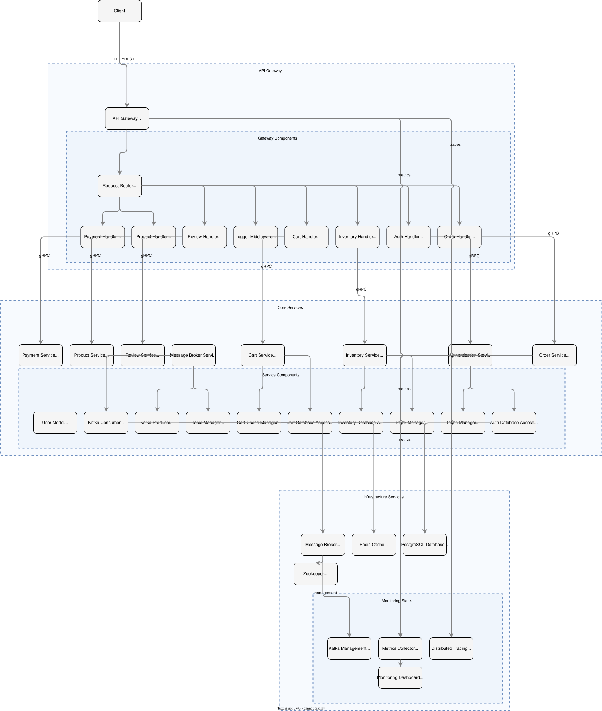

# 🛍️ E-commerce Microservices Platform

[](https://golang.org/)
[](https://www.docker.com/)
[](LICENSE)
[](https://grpc.io/)
[](https://kafka.apache.org/)

A production-ready, scalable e-commerce platform built with microservices architecture using Go, gRPC, and Apache Kafka. Designed for high performance, reliability, and maintainability.



## 🚀 Quick Start

```bash
# Clone the repository
git clone https://github.com/geoo115/E-commerceMicroservices.git
cd E-commerceMicroservices

# Configure environment
cp .env.example .env

# Start the platform
docker-compose up --build
```

**Access Points:**
* 🌐 API Gateway: `http://localhost:8080`
* 📊 Grafana Dashboard: `http://localhost:3000`
* 📈 Kafka UI: `http://localhost:8081`
* 🔍 Jaeger UI: `http://localhost:16686`

## 📋 Table of Contents

- [Features](#-features)
- [Architecture](#️-architecture)
- [Services](#-services)
- [Tech Stack](#-tech-stack)
- [API Documentation](#-api-endpoints)
- [Monitoring](#-monitoring)
- [Development](#️-development)
- [Contributing](#-contributing)

## ✨ Features

* 🔐 **Security**
  - JWT-based Authentication
  - Role-based Access Control
  - API Rate Limiting
  
* 🛒 **Core E-commerce**
  - Product Catalog Management
  - Order Processing Workflow
  - Shopping Cart System
  - Payment Gateway Integration
  
* 📦 **Infrastructure**
  - Real-time Inventory Tracking
  - Event-driven Architecture
  - Distributed Tracing
  - Auto-scaling Support

## 🏗️ Architecture
```
📁 Project Structure
ecommerce-microservices/
│── api-gateway/         # API Gateway (handles external requests)
│   ├── main.go
│   ├── handlers/        # (auth, cart, inventory, order, payment, product, review)
│   ├── router/
│   ├── middlewares/
│   ├── config.yaml
│   ├── Dockerfile
│   └── go.mod
│
├── auth-service/        # Authentication Service (User Management & JWT)
│   ├── main.go
│   ├── cache/
│   ├── models/
│   ├── db/
│   ├── proto/           # gRPC proto definitions
│   ├── services/
│   ├── utils/
│   ├── tests/           # Unit, integration, and API tests
│   ├── Dockerfile
│   └── go.mod
│
├── product-service/     # Product & Category Management
│   ├── main.go
│   ├── cache/
│   ├── models/
│   ├── db/
│   ├── proto/
│   ├── services/
│   ├── tests/
│   ├── Dockerfile
│   └── go.mod
│
├── order-service/       # Orders & Order Items
│   ├── main.go
│   ├── cache/
│   ├── models/
│   ├── db/
│   ├── proto/
│   ├── services/
│   ├── tests/
│   ├── Dockerfile
│   └── go.mod
│
├── cart-service/        # Cart Management
│   ├── main.go
│   ├── cache/
│   ├── models/
│   ├── db/
│   ├── proto/
│   ├── services/
│   ├── tests/
│   ├── Dockerfile
│   └── go.mod
│
├── payment-service/     # Payment Handling
│   ├── main.go
│   ├── cache/
│   ├── models/
│   ├── db/
│   ├── proto/
│   ├── services/
│   ├── tests/
│   ├── Dockerfile
│   └── go.mod
│
├── review-service/      # Wishlist & Reviews
│   ├── main.go
│   ├── cache/
│   ├── models/
│   ├── db/
│   ├── proto/
│   ├── services/
│   ├── tests/
│   ├── Dockerfile
│   └── go.mod
│
├── inventory-service/   # Product Inventory
│   ├── main.go
│   ├── cache/
│   ├── models/
│   ├── db/
│   ├── proto/
│   ├── services/
│   ├── tests/
│   ├── Dockerfile
│   └── go.mod
│
├── message-broker/      # Kafka/NATS for event-driven communication
│   ├── kafka-setup.sh
│   ├── topics/
│   ├── consumers/
│   ├── producers/
│   ├── event-schemas/   # Schema definitions for events
│   ├── Dockerfile
│   └── go.mod
│
├── monitoring/          # Monitoring and observability
│   ├── prometheus/
│   ├── grafana/
│   ├── jaeger/
│   ├── alerts/
│   ├── dashboards/
│   └── docker-compose.yml
│
├── docker-compose.yml   # Compose file for microservices setup
├── docker-compose.dev.yml  # Development environment specifics
└── README.md            # Documentation
```
### Component Flow


### Key Workflows

1. **Authentication Flow**
   ```
   Client → API Gateway → Auth Service → PostgreSQL
   ```

2. **Order Processing**
   ```
   Client → API Gateway → Order Service → (Inventory, Payment) → Kafka
   ```

3. **Real-time Updates**
   ```
   Kafka → [Inventory Service, Notification Service] → Client
   ```

## 🛠️ Services

| Service | Description | Technology | Port |
|---------|-------------|------------|------|
| API Gateway | Entry point for client requests | Gin, gRPC | 8080 |
| Auth | User authentication & authorization | JWT, PostgreSQL | 50051 |
| Product | Product catalog management | gRPC, PostgreSQL | 50052 |
| Order | Order processing workflow | gRPC, Kafka | 50053 |
| Inventory | Real-time stock management | gRPC, Kafka | 50054 |
| Payment | Payment processing | gRPC, PostgreSQL | 50055 |
| Cart | Shopping cart management | Redis, gRPC | 50056 |

## 💻 Tech Stack

### Core Technologies
* 🔷 **Go** (1.23+) - Primary programming language
* 🔶 **gRPC** - Inter-service communication
* 📀 **PostgreSQL** - Primary data store
* 📡 **Apache Kafka** - Event streaming
* ⚡ **Redis** - Caching layer

### Infrastructure
* 🐳 Docker & Docker Compose
* 📊 Prometheus & Grafana
* 🔍 Jaeger Tracing
* 🔄 Kubernetes (optional)

## 🔌 API Endpoints

### Authentication
```http
POST /api/v1/auth/register
Content-Type: application/json

{
  "email": "user@example.com",
  "password": "securepass",
  "name": "John Doe"
}
```

### Product Management
```http
GET /api/v1/products?category=electronics&page=1&limit=10
Authorization: Bearer <JWT_TOKEN>
```

### Order Processing
```http
POST /api/v1/orders
Authorization: Bearer <JWT_TOKEN>

{
  "items": [
    {
      "product_id": "123e4567-e89b-12d3-a456-426614174000",
      "quantity": 2
    }
  ],
  "shipping_address": {
    "street": "123 Main St",
    "city": "Springfield",
    "country": "US"
  }
}
```

📚 [View Full API Documentation →](docs/api.md)

## 📊 Monitoring

| Tool | Purpose | URL |
|------|---------|-----|
| Grafana | Metrics visualization | `http://localhost:3000` |
| Prometheus | Metrics collection | `http://localhost:9090` |
| Jaeger | Distributed tracing | `http://localhost:16686` |
| Kafka UI | Event monitoring | `http://localhost:8081` |

## 🛠️ Development

### Prerequisites
* Go 1.23+
* Docker 20.10+
* Protocol Buffers compiler
* Make

### Local Setup
```bash
# Generate protobuf files
make proto

# Run unit tests
make test

# Run integration tests
make integration-test

# Start specific service
docker-compose up api-gateway
```

### Environment Configuration
```ini
# API Gateway
PORT=8080
AUTH_SERVICE_ADDR=auth-service:50051
RATE_LIMIT=100

# Auth Service
JWT_SECRET=your-secret-key
JWT_EXPIRY=24h
DB_HOST=postgres-auth

# Kafka
KAFKA_BROKERS=kafka:9092
KAFKA_GROUP_ID=ecommerce-group
```

## 🤝 Contributing

We welcome contributions! Please follow these steps:

1. Fork the repository
2. Create a feature branch
3. Commit your changes
4. Push to your branch
5. Create a Pull Request

Read our [Contribution Guidelines](CONTRIBUTING.md) for more details.

## 📝 License

This project is licensed under the MIT License - see the [LICENSE](LICENSE) file for details.
