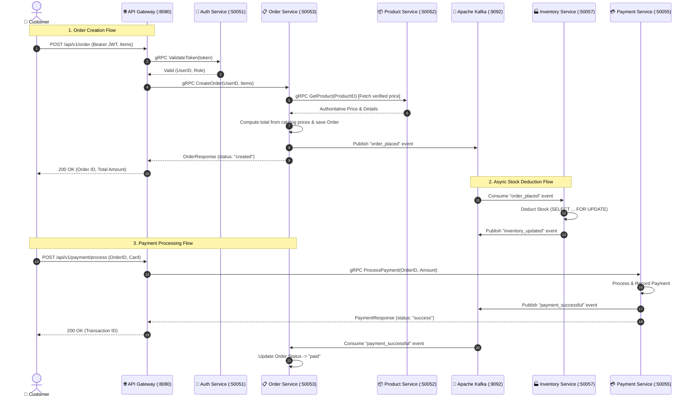

# 🛍️ Enterprise E-Commerce Microservices Platform

[](https://golang.org/)
[](https://grpc.io/)
[](https://kafka.apache.org/)
[](https://www.postgresql.org/)
[](https://redis.io/)
[](https://www.docker.com/)
[](https://prometheus.io/)
[](LICENSE)

A production-grade, highly scalable distributed e-commerce backend built with **Go (Golang)**, **gRPC**, **Protocol Buffers**, and **Apache Kafka**. Designed from the ground up following Domain-Driven Design (DDD), Database-per-Service isolation, Event-Driven Choreography, and strict security and concurrency standards.

---

## 📑 Table of Contents

- [Overview](#-overview)
- [Architecture & Execution Flows Guide (ARCHITECTURE_FLOWS.md)](ARCHITECTURE_FLOWS.md) 🗺️
- [Interactive Visual Architecture Dashboard (ARCHITECTURE_FLOWS.html)](ARCHITECTURE_FLOWS.html) 🌐
- [Master Technical Interview Preparation Guide (INTERVIEW_PREPARATION_GUIDE.md)](INTERVIEW_PREPARATION_GUIDE.md) 🎯
- [System Architecture](#-system-architecture)
  - [High-Level Architecture](#high-level-architecture)
  - [Service Interaction & Data Flow](#service-interaction--data-flow)
  - [Database-per-Service Pattern](#database-per-service-pattern)
- [Services Directory](#-services-directory)
- [Key Architectural Patterns & Best Practices](#-key-architectural-patterns--best-practices)
  - [Security & RBAC Enforcement](#1-security--rbac-enforcement)
  - [Authoritative Pricing & Anti-Tampering](#2-authoritative-pricing--anti-tampering)
  - [Inventory Concurrency with Row-Level Locking](#3-inventory-concurrency-with-row-level-locking)
  - [Event-Driven Choreography & Saga](#4-event-driven-choreography--saga)
  - [Persistent Multiplexed gRPC Connections](#5-persistent-multiplexed-grpc-connections)
- [Apache Kafka Event Specifications](#-apache-kafka-event-specifications)
- [REST API Reference (API Gateway)](#-rest-api-reference-api-gateway)
  - [Authentication & User Management](#-authentication--user-management)
  - [Product Catalog & Categories](#-product-catalog--categories)
  - [Shopping Cart](#-shopping-cart)
  - [Order Management](#-order-management)
  - [Payment Processing](#-payment-processing)
  - [Product Reviews](#-product-reviews)
  - [Inventory Control](#-inventory-control)
  - [Metrics & Health Checks](#-metrics--health-checks)
- [Quick Start](#-quick-start)
  - [Prerequisites](#prerequisites)
  - [Running with Docker Compose](#running-with-docker-compose)
  - [Running Locally with Go Workspaces](#running-locally-with-go-workspaces)
- [Monitoring & Observability](#-monitoring--observability)
- [Testing](#-testing)
- [License](#-license)

---

## 🌟 Overview

This platform models a complete distributed e-commerce lifecycle:
1. **User Registration & Email Verification**: Users register, receive verification codes backed by Redis TTLs, verify accounts, and log in to receive cryptographically signed JWTs.
2. **Catalog Browsing & Administration**: Public browsing and searching of products with Redis caching, alongside admin-restricted CRUD endpoints with role-based validation.
3. **Cart Persistence**: Synchronized in-memory Redis caching with PostgreSQL storage, guarded by JWT context to eliminate Insecure Direct Object References (IDOR).
4. **Tamper-Proof Ordering**: Orders are placed with server-authoritative pricing verified directly against the product catalog via gRPC.
5. **Decoupled Event Streaming**: Kafka brokers distribute order and payment events asynchronously across services without blocking HTTP request threads.
6. **Stock Management**: Inventory updates utilize atomic database row-level locking (`SELECT ... FOR UPDATE`) to prevent race conditions and over-selling under high concurrency.
7. **Simulated Payment Gateway**: Autonomous transaction lifecycle with failure handling and order status resolution.

---

## 🏗️ System Architecture

### High-Level Architecture

```
                                  ┌─────────────────────────┐
                                  │      Client / Web       │
                                  └────────────┬────────────┘
                                               │ HTTP / REST (JSON)
                                  ┌────────────▼────────────┐
                                  │       API Gateway       │
                                  │       (Port 8080)       │
                                  │  [JWT Auth, RBAC, Prom] │
                                  └────────────┬────────────┘
                                               │
               ┌───────────────────────────────┼───────────────────────────────┐
               │ gRPC                          │ gRPC                          │ gRPC
     ┌─────────▼─────────┐           ┌─────────▼─────────┐           ┌─────────▼─────────┐
     │   Auth Service    │           │  Product Service  │           │   Cart Service    │
     │   (Port 50051)    │           │   (Port 50052)    │           │   (Port 50054)    │
     └─────────┬─────────┘           └─────────┬─────────┘           └─────────┬─────────┘
               │                               │                               │
               │                               │ gRPC                          │
               │                     ┌─────────▼─────────┐                     │
               │                     │   Order Service   │                     │
               │                     │   (Port 50053)    │                     │
               │                     └─────────┬─────────┘                     │
               │                               │                               │
     ┌─────────▼─────────┐           ┌─────────▼─────────┐           ┌─────────▼─────────┐
     │  Payment Service  │           │ Inventory Service │           │  Review Service   │
     │   (Port 50055)    │           │   (Port 50057)    │           │   (Port 50056)    │
     └─────────┬─────────┘           └─────────┬─────────┘           └─────────┬─────────┘
               │                               │                               │
               └───────────────────────┬───────┴───────────────────────────────┘
                                       │ Kafka Pub/Sub Events
                             ┌─────────▼─────────┐
                             │   Apache Kafka    │
                             │    (Port 9092)    │
                             └───────────────────┘
```

### Service Interaction & Data Flow


```mermaid
sequenceDiagram
    autonumber
    actor Customer as 👤 Customer
    participant Gateway as 🌐 API Gateway (:8080)
    participant Auth as 🔐 Auth Service (:50051)
    participant Order as 📋 Order Service (:50053)
    participant Product as 📦 Product Service (:50052)
    participant Kafka as 📡 Apache Kafka (:9092)
    participant Inventory as 🏭 Inventory Service (:50057)
    participant Payment as 💳 Payment Service (:50055)

    Note over Customer, Gateway: 1. Order Creation Flow
    Customer->>Gateway: POST /api/v1/order (Bearer JWT, Items)
    Gateway->>Auth: gRPC ValidateToken(token)
    Auth-->>Gateway: Valid (UserID, Role)
    Gateway->>Order: gRPC CreateOrder(UserID, Items)
    
    Order->>Product: gRPC GetProduct(ProductID) [Fetch verified price]
    Product-->>Order: Authoritative Price & Details
    Order->>Order: Compute total from catalog prices & save Order
    Order->>Kafka: Publish "order_placed" event
    Order-->>Gateway: OrderResponse (status: "created")
    Gateway-->>Customer: 200 OK (Order ID, Total Amount)

    Note over Kafka, Inventory: 2. Async Stock Deduction Flow
    Kafka->>Inventory: Consume "order_placed" event
    Inventory->>Inventory: Deduct Stock (SELECT ... FOR UPDATE)
    Inventory->>Kafka: Publish "inventory_updated" event

    Note over Customer, Order: 3. Payment Processing Flow
    Customer->>Gateway: POST /api/v1/payment/process (OrderID, Card)
    Gateway->>Payment: gRPC ProcessPayment(OrderID, Amount)
    Payment->>Payment: Process & Record Payment
    Payment->>Kafka: Publish "payment_successful" event
    Payment-->>Gateway: PaymentResponse (status: "success")
    Gateway-->>Customer: 200 OK (Transaction ID)

    Kafka->>Order: Consume "payment_successful" event
    Order->>Order: Update Order Status -> "paid"
```

### Database-per-Service Pattern

Each microservice manages its own private relational schema within PostgreSQL, preventing cross-database coupling and ensuring service autonomy:

| Service | Database Name | Primary Entities / Models |
| :--- | :--- | :--- |
| **Auth Service** | `ecommerce_users` | `users`, `addresses` |
| **Product Service** | `ecommerce_products` | `products`, `categories` |
| **Order Service** | `ecommerce_order` | `orders`, `order_items` |
| **Cart Service** | `ecommerce_cart` | `carts` |
| **Payment Service** | `ecommerce_payment` | `payments` |
| **Review Service** | `ecommerce_review` | `reviews` |
| **Inventory Service** | `ecommerce_inventory` | `inventories` |

---

## 🛠️ Services Directory

| Directory | Tech Stack | Internal Port | External Port | Description |
| :--- | :--- | :--- | :--- | :--- |
| [`api-gateway/`](api-gateway/) | Gin, gRPC Client, Viper, Prometheus | - | `8080` | REST API gateway, JWT verification, RBAC, reverse proxy to gRPC services |
| [`auth-service/`](auth-service/) | gRPC, GORM, bcrypt, JWT, Redis | `50051` | `50051` | User registration, verification tokens, authentication, JWT issuing & validation |
| [`product-service/`](product-service/) | gRPC, GORM, Redis | `50052` | `50052` | Product catalog, categories, search, price authority |
| [`order-service/`](order-service/) | gRPC, GORM, Kafka Producer & Consumer | `50053` | `50053` | Order lifecycle, server-verified pricing, Kafka event publishing |
| [`cart-service/`](cart-service/) | gRPC, GORM, Redis Cache | `50054` | `50054` | Shopping cart with Redis caching and PostgreSQL persistence |
| [`payment-service/`](payment-service/) | gRPC, GORM, Kafka Producer, UUID | `50055` | `50055` | Payment processing simulation, transaction verification, event publishing |
| [`review-service/`](review-service/) | gRPC, GORM, Kafka Consumer | `50056` | `50056` | Product reviews, ratings calculation, feedback management |
| [`inventory-service/`](inventory-service/) | gRPC, GORM, Row-Level Locking, Kafka | `50057` | `50057` | Atomic stock reservation, restock management, Kafka event consumer |
| [`message-broker/`](message-broker/) | Confluent Kafka (librdkafka), Sync.Once | `9092` | `9092` | Shared Kafka producer singleton and consumer utilities |

---

## 💎 Key Architectural Patterns & Best Practices

### 1. Security & RBAC Enforcement
- **Stateless JWT Authentication**: Tokens are validated using `auth-service`'s `ValidateToken` RPC.
- **Injected Identity**: The API Gateway extracts `userID` and `role` into Gin's context (`c.Set("userID", ...)`).
- **IDOR Protection**: User-owned endpoints (cart, orders, reviews) strictly override client-supplied IDs with the authenticated token's `userID`.
- **Role-Based Access Control (RBAC)**: Privileged routes (product mutations, category creation, inventory management) require the `admin` role via `middlewares.RequireRole("admin")`.

### 2. Authoritative Pricing & Anti-Tampering
- The client request **never** dictates product prices during order creation.
- When `CreateOrder` is invoked, `order-service` calls `product-service` over gRPC to fetch the verified catalog price for every product. Total amounts and order item prices are calculated strictly from backend authoritative data.

### 3. Inventory Concurrency with Row-Level Locking
- In high-throughput e-commerce flash sales, naive reads and writes create race conditions leading to overselling.
- `inventory-service` executes `UpdateStock` inside a database transaction with PostgreSQL row locking:
  ```go
  err := tx.Clauses(clause.Locking{Strength: "UPDATE"}).
      Where("product_id = ?", req.ProductId).
      First(&inv).Error
  ```
- Any concurrent transaction attempting to modify the same stock is safely queued until the lock commits or rolls back, enforcing `stock >= 0`.

### 4. Event-Driven Choreography & Saga
- When an order is created, `order-service` publishes an `order_placed` event to Kafka.
- `inventory-service` consumes `order_placed` and automatically deducts stock.
- When `payment-service` processes payment, it publishes `payment_successful`.
- `order-service` consumes `payment_successful` and marks the order status as `"paid"`.

### 5. Persistent Multiplexed gRPC Connections
- Standard gRPC is built on HTTP/2 and designed for long-lived multiplexed connections.
- The API Gateway maintains singleton, thread-safe `*grpc.ClientConn` instances across all handlers, eliminating connection churn, socket exhaustion, and TCP handshake latency.

---

## 📡 Apache Kafka Event Specifications

| Topic Name | Producer Service | Consumer Service(s) | Description | Payload Schema |
| :--- | :--- | :--- | :--- | :--- |
| `order_placed` | `order-service` | `inventory-service` | Emitted when a customer places an order | `{"ID": 1, "user_id": 42, "total_amount": 199.98, "status": "created", "Items": [{"product_id": 101, "quantity": 2, "price": 99.99}]}` |
| `payment_successful` | `payment-service` | `order-service` | Emitted when payment successfully clears | `{"ID": 8, "order_id": 1, "transaction_id": "uuid-v4", "status": "success", "amount": 199.98}` |
| `inventory_updated` | `inventory-service` | Analytics / Audit | Emitted after any stock modification | `{"productId": 101, "stock": 48}` |
| `review_added` | `review-service` | `product-service` | Emitted when a new review is submitted | `{"reviewId": 5, "productId": 101, "rating": 5}` |
| `review_deleted` | `review-service` | `product-service` | Emitted when a review is deleted | `{"reviewId": 5, "productId": 101}` |

---

## 🔌 REST API Reference (API Gateway)

Base URL: `http://localhost:8080`

### 🔐 Authentication & User Management

#### 1. User Registration
`POST /api/v1/auth/signup`
```json
{
  "username": "johndoe",
  "email": "john@example.com",
  "password": "Password123!",
  "phone": "+1234567890",
  "address": {
    "address_line1": "123 Market St",
    "city": "San Francisco",
    "state": "CA",
    "postal_code": "94103",
    "country": "USA"
  }
}
```
**Response (200 OK):**
```json
{
  "success": true,
  "user_id": 1,
  "username": "johndoe",
  "email": "john@example.com",
  "message": "Signup successful. Please verify your email with the verification code"
}
```

#### 2. Email Verification
`POST /api/v1/auth/verify-email`
```json
{
  "email": "john@example.com",
  "code": "123456"
}
```
**Response (200 OK):**
```json
{
  "success": true,
  "message": "Email verified successfully"
}
```

#### 3. User Login
`POST /api/v1/auth/login`
```json
{
  "username": "johndoe",
  "password": "Password123!"
}
```
**Response (200 OK):**
```json
{
  "user_id": 1,
  "username": "johndoe",
  "email": "john@example.com",
  "access_token": "eyJhbGciOiJIUzI1NiIsIn...",
  "role": "customer"
}
```

#### 4. Validate Token
`POST /api/v1/auth/validate`
```json
{
  "token": "eyJhbGciOiJIUzI1NiIsIn..."
}
```
**Response (200 OK):**
```json
{
  "is_valid": true,
  "user_id": 1,
  "role": "customer"
}
```

---

### 📦 Product Catalog & Categories

#### 1. List Products (Paginated)
`GET /api/v1/product/?page=1&limit=10`
* **Access**: Public

#### 2. Get Product by ID
`GET /api/v1/product/:id`
* **Access**: Public

#### 3. Create Product
`POST /api/v1/product/`
* **Access**: Protected (`Admin` role required)
* **Header**: `Authorization: Bearer <ADMIN_JWT>`
```json
{
  "name": "Mechanical Keyboard RGB",
  "price": 129.99,
  "category_id": 1,
  "description": "Hot-swappable mechanical switches",
  "stock": 50
}
```

#### 4. Update Product
`PUT /api/v1/product/:id`
* **Access**: Protected (`Admin` role required)

#### 5. Delete Product
`DELETE /api/v1/product/:id`
* **Access**: Protected (`Admin` role required)

#### 6. Create Category
`POST /api/v1/category/`
* **Access**: Protected (`Admin` role required)
```json
{
  "name": "Electronics"
}
```

---

### 🛒 Shopping Cart

> **Note**: All cart operations automatically extract `userId` from the authenticated JWT token to protect against IDOR.

#### 1. Get Authenticated User's Cart
`GET /api/v1/cart`
* **Header**: `Authorization: Bearer <JWT>`

#### 2. Add Item to Cart
`POST /api/v1/cart/add`
* **Header**: `Authorization: Bearer <JWT>`
```json
{
  "product_id": 1,
  "quantity": 2
}
```

#### 3. Remove Item from Cart
`POST /api/v1/cart/remove`
* **Header**: `Authorization: Bearer <JWT>`
```json
{
  "product_id": 1
}
```

#### 4. Clear Entire Cart
`DELETE /api/v1/cart/clear`
* **Header**: `Authorization: Bearer <JWT>`

---

### 📋 Order Management

#### 1. Create Order
`POST /api/v1/order/`
* **Header**: `Authorization: Bearer <JWT>`
```json
{
  "items": [
    {
      "product_id": 1,
      "quantity": 2
    }
  ]
}
```
**Response (200 OK):**
```json
{
  "order_id": 101,
  "user_id": 1,
  "total_amount": 259.98,
  "status": "created",
  "items": [
    {
      "order_item_id": 1,
      "product_id": 1,
      "quantity": 2,
      "price": 129.99
    }
  ]
}
```

#### 2. Get Order by ID
`GET /api/v1/order/:id`
* **Header**: `Authorization: Bearer <JWT>`
* **Access**: Order owner or Admin

#### 3. List User Orders
`GET /api/v1/order/user/:userId?page=1&limit=10`
* **Header**: `Authorization: Bearer <JWT>`
* **Access**: Order owner or Admin

#### 4. Update Order Status (Admin)
`PUT /api/v1/order/:id`
* **Header**: `Authorization: Bearer <ADMIN_JWT>`
```json
{
  "order_id": 101,
  "status": "shipped"
}
```

---

### 💳 Payment Processing

#### 1. Process Payment
`POST /api/v1/payment/process`
* **Header**: `Authorization: Bearer <JWT>`
```json
{
  "order_id": 101,
  "amount": 259.98,
  "currency": "USD",
  "payment_method": "credit_card",
  "card_last_four": "4242"
}
```
**Response (200 OK):**
```json
{
  "payment_id": 55,
  "order_id": 101,
  "amount": 259.98,
  "currency": "USD",
  "payment_method": "credit_card",
  "status": "success",
  "transaction_id": "c138d3fe-e8a2-4a0f-a9cb-b09f4eef57d1",
  "payment_gateway": "TestGateway",
  "processed_at": "2026-09-29T10:30:00Z"
}
```

#### 2. Get Payment by Order ID
`GET /api/v1/payment/:orderId`
* **Header**: `Authorization: Bearer <JWT>`

---

### ⭐ Product Reviews

#### 1. List Reviews for Product
`GET /api/v1/review/:productId`
* **Access**: Public

#### 2. Submit Review
`POST /api/v1/review/`
* **Header**: `Authorization: Bearer <JWT>`
```json
{
  "product_id": 1,
  "rating": 5,
  "comment": "Exceptional quality and fast delivery!"
}
```

#### 3. Delete Review
`DELETE /api/v1/review/:reviewId`
* **Header**: `Authorization: Bearer <JWT>`

---

### 🏭 Inventory Control

#### 1. Get Product Stock
`GET /api/v1/inventory/:productId`
* **Access**: Public

#### 2. Update Product Stock (Manual Restock)
`POST /api/v1/inventory/update`
* **Header**: `Authorization: Bearer <ADMIN_JWT>`
```json
{
  "product_id": 1,
  "delta": 25
}
```

---

### 📊 Metrics & Health Checks

| Endpoint | Method | Access | Description |
| :--- | :--- | :--- | :--- |
| `/health` | `GET` | Public | Service health verification |
| `/metrics` | `GET` | Public / Scraper | Real Prometheus metrics endpoint |

---

## 🚀 Quick Start

### Prerequisites
- **Docker** & **Docker Compose**
- **Go 1.24+** (if compiling or developing locally)

### Running with Docker Compose

1. **Clone the repository:**
   ```bash
   git clone https://github.com/geoo115/E-commerceMicroservices.git
   cd E-commerceMicroservices
   ```

2. **Launch the entire stack:**
   ```bash
   docker-compose up --build -d
   ```

3. **Check running containers:**
   ```bash
   docker-compose ps
   ```

4. **Verify Gateway health:**
   ```bash
   curl http://localhost:8080/health
   ```

---

### Running Locally with Go Workspaces

1. **Start infrastructure services only:**
   ```bash
   docker-compose up -d postgres redis kafka zookeeper
   ```

2. **Verify Go Workspace setup:**
   ```bash
   go work sync
   ```

3. **Run services in separate terminals:**
   ```bash
   # Terminal 1: Auth Service
   cd auth-service && go run main.go

   # Terminal 2: Product Service
   cd product-service && go run main.go

   # Terminal 3: Inventory Service
   cd inventory-service && go run main.go

   # Terminal 4: Order Service
   cd order-service && go run main.go

   # Terminal 5: Cart Service
   cd cart-service && go run main.go

   # Terminal 6: Payment Service
   cd payment-service && go run main.go

   # Terminal 7: Review Service
   cd review-service && go run main.go

   # Terminal 8: API Gateway
   cd api-gateway && go run main.go
   ```

---

## 📊 Monitoring & Observability

| Tool | Purpose | Local Access URL | Default Credentials |
| :--- | :--- | :--- | :--- |
| **API Gateway Metrics** | Prometheus standard scraping endpoint | `http://localhost:8080/metrics` | Public |
| **Prometheus** | Metrics aggregation & time-series storage | `http://localhost:9090` | None |
| **Grafana** | Dashboards & metrics visualization | `http://localhost:3000` | `admin` / `admin` |
| **Kafka UI** | Topic inspection, partition offsets & events | `http://localhost:8081` | None |
| **Jaeger UI** | Distributed tracing console | `http://localhost:16686` | None |

---

## 🧪 Testing

All services include isolated unit and integration test suites:

```bash
# Run all tests across the workspace
for dir in auth-service cart-service inventory-service order-service payment-service product-service review-service; do
  echo "=== Running tests for $dir ==="
  (cd $dir && go test -v ./tests)
done
```

---

