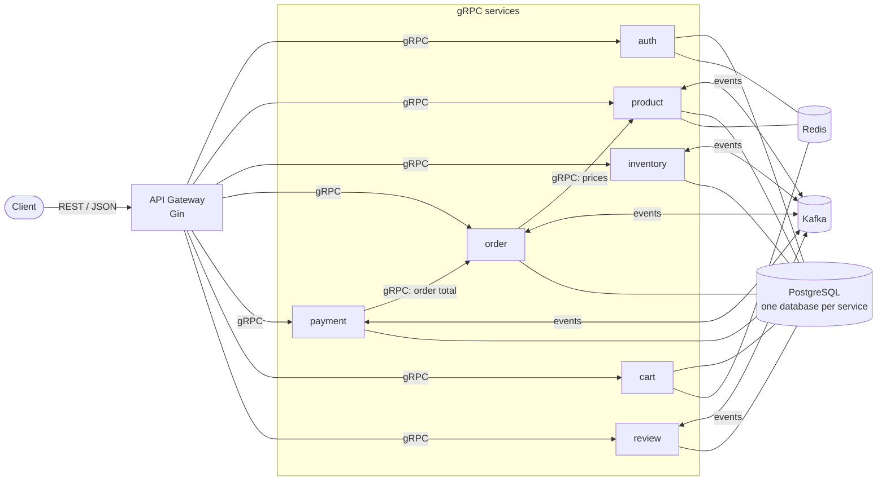
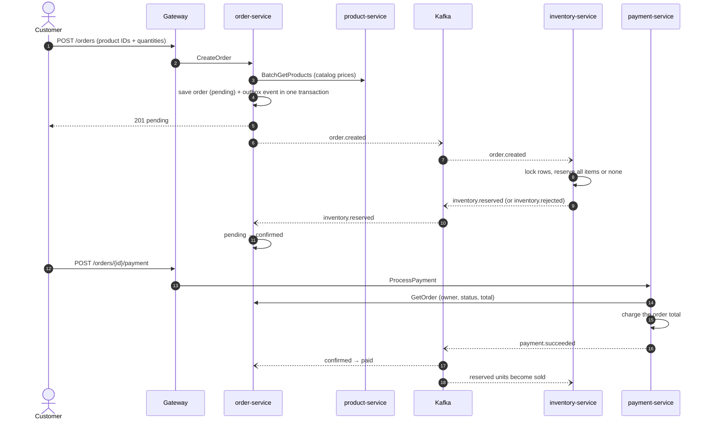

# E-commerce Microservices in Go

[](https://github.com/geoo115/E-commerceMicroservices/actions/workflows/ci.yml)
[](go.mod)
[](LICENSE)

An e-commerce backend made of seven Go microservices behind a REST API gateway.
Services talk to each other synchronously over **gRPC** and asynchronously
through **Kafka** events. Each service owns its own **PostgreSQL** database.

The project focuses on the problems that show up once a system is distributed:
keeping data consistent without distributed transactions, never losing or
double-processing an event, avoiding overselling under concurrent orders, and
not trusting anything the client sends.

## Highlights

- **Order saga with compensation.** An order goes `pending → confirmed → paid`
  through events exchanged by the order, inventory and payment services. If
  stock runs out or the customer cancels, reserved stock is released. ([details](docs/architecture.md#order-saga))
- **Transactional outbox and idempotent consumers.** Events are written in the
  same database transaction as the state change, published by a relay, and
  deduplicated on the consumer side. Failing messages are retried, then sent
  to a dead-letter topic.
- **No overselling.** Stock is reserved all-or-nothing under `SELECT … FOR UPDATE`,
  with locks taken in a fixed order to avoid deadlocks. A test fires
  50 concurrent orders at 10 units and checks that exactly 10 succeed.
- **The server decides prices and amounts.** Order prices come from the
  catalog, payments charge the order total, and a partial unique index
  prevents double charging.
- **Security basics.** JWT authentication, admin role checks, ownership checks
  on every user resource, rate-limited auth endpoints, bcrypt, random
  verification codes with attempt limits, and no internal error details in
  responses.
- **Observability.** JSON logs with a request ID that follows each request
  across services, Prometheus metrics for HTTP, gRPC and events, and a
  pre-built Grafana dashboard.
- **Tested at three levels.** Unit tests, integration tests against PostgreSQL,
  and an end-to-end smoke test (42 checks) that runs against the full Docker
  stack in CI.

## Architecture


```mermaid
flowchart LR
    client([Client]) -->|REST / JSON| gw[API Gateway<br/>Gin]

    subgraph services [gRPC services]
        auth[auth]
        product[product]
        inventory[inventory]
        order[order]
        payment[payment]
        cart[cart]
        review[review]
    end

    gw -->|gRPC| auth & product & inventory & order & payment & cart & review
    order -->|gRPC: prices| product
    payment -->|gRPC: order total| order

    order & inventory & payment & product & review <-->|events| kafka[(Kafka)]

    auth & product & inventory & order & payment & cart & review --- pg[(PostgreSQL<br/>one database per service)]
    auth & product & cart --- redis[(Redis)]
```

| Service | Responsibility | Publishes | Consumes |
|---|---|---|---|
| **api-gateway** | REST API, authentication, authorization, request validation, API composition | – | – |
| **auth-service** | Accounts, email verification, JWT issuing and validation | – | – |
| **product-service** | Catalog, categories, prices (cached in Redis), rating aggregates | `product.created` | `review.*` |
| **inventory-service** | Stock levels and reservations | `inventory.reserved`, `inventory.rejected` | `order.*`, `payment.succeeded`, `product.created` |
| **order-service** | Order lifecycle (state machine) | `order.created`, `order.cancelled` | `inventory.*`, `payment.succeeded` |
| **payment-service** | Charges confirmed orders through a simulated provider | `payment.succeeded`, `payment.failed` | – |
| **cart-service** | Shopping carts (PostgreSQL, cached in Redis) | – | – |
| **review-service** | Reviews and wishlists | `review.created`, `review.deleted` | – |

### Order flow


```mermaid
sequenceDiagram
    autonumber
    actor C as Customer
    participant G as Gateway
    participant O as order-service
    participant P as product-service
    participant K as Kafka
    participant I as inventory-service
    participant Pay as payment-service

    C->>G: POST /orders (product IDs + quantities)
    G->>O: CreateOrder
    O->>P: BatchGetProducts (catalog prices)
    O->>O: save order (pending) + outbox event in one transaction
    O-->>C: 201 pending
    O--)K: order.created
    K--)I: order.created
    I->>I: lock rows, reserve all items or none
    I--)K: inventory.reserved (or inventory.rejected)
    K--)O: inventory.reserved
    O->>O: pending → confirmed

    C->>G: POST /orders/{id}/payment
    G->>Pay: ProcessPayment
    Pay->>O: GetOrder (owner, status, total)
    Pay->>Pay: charge the order total
    Pay--)K: payment.succeeded
    K--)O: confirmed → paid
    K--)I: reserved units become sold
```

## Quick start

Requirements: Docker with Compose v2, `make`, and `curl` + `jq` for the smoke test.

```bash
git clone https://github.com/geoo115/E-commerceMicroservices.git
cd E-commerceMicroservices

make up      # creates .env from .env.example, builds and starts everything
make smoke   # runs the end-to-end scenario against the running stack
make down    # stops everything and deletes the data
```

| URL | What |
|---|---|
| http://localhost:8080 | REST API |
| http://localhost:3000 | Grafana (dashboard "E-commerce overview") |
| http://localhost:9090 | Prometheus |
| http://localhost:8081 | Kafka UI (topics, consumer groups, dead-letter topics) |

### Try it with curl

```bash
# Log in as the seeded admin and create a product
ADMIN=$(curl -s localhost:8080/api/v1/auth/login \
  -d '{"username":"admin","password":"admin-password-change-me"}' | jq -r .access_token)
curl -s localhost:8080/api/v1/categories -H "Authorization: Bearer $ADMIN" -d '{"name":"Keyboards"}'
curl -s localhost:8080/api/v1/products -H "Authorization: Bearer $ADMIN" \
  -d '{"name":"Mechanical Keyboard","price_cents":12999,"category_id":1,"initial_stock":10}'

# Sign up. Email delivery is stubbed: the code is logged by auth-service and stored in Redis.
curl -s localhost:8080/api/v1/auth/signup \
  -d '{"username":"alice","email":"alice@example.com","password":"password123"}'
CODE=$(docker compose exec -T redis redis-cli GET verify:alice@example.com)
curl -s localhost:8080/api/v1/auth/verify-email -d "{\"email\":\"alice@example.com\",\"code\":\"$CODE\"}"
TOKEN=$(curl -s localhost:8080/api/v1/auth/login \
  -d '{"username":"alice","password":"password123"}' | jq -r .access_token)

# Order, wait for confirmation, then pay
curl -s localhost:8080/api/v1/orders -H "Authorization: Bearer $TOKEN" \
  -d '{"items":[{"product_id":1,"quantity":2}]}'
curl -s localhost:8080/api/v1/orders/1 -H "Authorization: Bearer $TOKEN" | jq .status   # "confirmed"
curl -s localhost:8080/api/v1/orders/1/payment -H "Authorization: Bearer $TOKEN" \
  -d '{"method":"card","card_last_four":"4242"}'
```

Cards ending in `0002` are declined by the simulated provider.

## REST API

All endpoints are under `/api/v1`. Prices and amounts are integers in cents.
Errors have the shape `{"error": {"code": "NOT_FOUND", "message": "..."}}`.

| Method | Path | Auth | Description |
|---|---|---|---|
| POST | `/auth/signup` | – | Create an account (sends a verification code) |
| POST | `/auth/verify-email` | – | Verify the email with the 6-digit code |
| POST | `/auth/resend-code` | – | Send a new verification code |
| POST | `/auth/login` | – | Get an access token |
| GET | `/users/me` | user | Current user's profile |
| GET | `/categories` | – | List categories |
| POST | `/categories` | admin | Create a category |
| GET | `/products?q=&category_id=&page=&page_size=` | – | Search products |
| GET | `/products/{id}` | – | Product with available stock |
| POST / PUT / DELETE | `/products`, `/products/{id}` | admin | Manage products |
| GET | `/products/{id}/reviews` | – | List reviews |
| POST | `/products/{id}/reviews` | user | Review a product (once per user) |
| DELETE | `/reviews/{id}` | author or admin | Delete a review |
| GET / PUT / DELETE | `/wishlist`, `/wishlist/{productId}` | user | Manage the wishlist |
| GET / DELETE | `/cart` | user | Get or clear the cart |
| POST | `/cart/items` | user | Add a product to the cart |
| PUT / DELETE | `/cart/items/{productId}` | user | Change the quantity or remove a product |
| POST | `/cart/checkout` | user | Turn the cart into an order |
| POST | `/orders` | user | Place an order |
| GET | `/orders` | user | List the caller's orders |
| GET | `/orders/{id}` | owner or admin | Get an order |
| POST | `/orders/{id}/cancel` | owner or admin | Cancel a pending or confirmed order |
| PATCH | `/orders/{id}/status` | admin | Mark an order `shipped` or `delivered` |
| POST | `/orders/{id}/payment` | owner | Pay a confirmed order (402 if declined) |
| GET | `/orders/{id}/payment` | owner or admin | Latest payment of an order |
| GET | `/inventory/{productId}` | admin | Stock levels |
| POST | `/inventory/{productId}/adjustments` | admin | Restock or write off (`{"delta": 10}`) |

`GET /healthz` and `GET /metrics` are served at the root.

## Development

```bash
make help              # list all targets
make test              # unit tests (integration tests skip without a database)
make up && make test-integration   # unit + integration tests against the Postgres container
make lint              # golangci-lint + buf lint
make proto             # regenerate gRPC code after editing api/proto
make tools             # install buf, protoc plugins and golangci-lint
```

### Configuration

Services are configured only through environment variables. The full set
for each service is in [`docker-compose.yml`](docker-compose.yml).

| Variable | Used by | Default |
|---|---|---|
| `GRPC_ADDR` / `HTTP_ADDR` | services / gateway | `:5005x` / `:8080` |
| `DATABASE_HOST`, `DATABASE_PORT`, `DATABASE_USER`, `DATABASE_PASSWORD`, `DATABASE_NAME` | services with a database | `localhost`, `5432`, `postgres`, `postgres`, service name |
| `REDIS_ADDR` | auth, product, cart | `localhost:6379` |
| `KAFKA_BROKERS` | services that publish or consume events | `localhost:9092` |
| `<NAME>_SERVICE_ADDR` | gateway, order, payment | `localhost:<port>` |
| `JWT_SECRET` (required, ≥ 32 bytes), `JWT_TTL` | auth | –, `24h` |
| `ADMIN_USERNAME`, `ADMIN_EMAIL`, `ADMIN_PASSWORD` | auth (seeds the admin account) | – |
| `METRICS_ADDR`, `LOG_LEVEL` | all | `:9100`, `info` |

To run a service on the host, start the infrastructure with
`docker compose up -d postgres redis kafka` and point the service at the
published ports. gRPC dependencies (here, product-service on `:50052`) need
to run locally as well. For example:

```bash
DATABASE_PORT=15432 DATABASE_USER=order_svc DATABASE_PASSWORD=order_svc DATABASE_NAME=orders \
KAFKA_BROKERS=localhost:9094 GRPC_ADDR=:50053 go run ./order-service
```

### Tests worth reading

| Test | What it shows |
|---|---|
| [`TestReserve_NoOversellUnderConcurrency`](inventory-service/internal/inventory/service_test.go) | 50 concurrent orders for 10 units: exactly 10 reserved |
| [`TestReserve_NoDeadlockWithOverlappingOrders`](inventory-service/internal/inventory/service_test.go) | Orders locking the same rows in opposite order don't deadlock |
| [`TestProcessPayment_ConcurrentAttemptsChargeOnce`](payment-service/internal/payment/service_test.go) | 10 concurrent payments for one order: exactly one charge |
| [`TestSaga_OrderLifecycle`](order-service/internal/order/service_test.go) | State machine, duplicate events and stale events |
| [`TestRelay_KeepsRowsWhenBrokerIsDown`](pkg/events/events_test.go) | The outbox does not lose events while Kafka is down |
| [`TestGRPCErrorMapping`](api-gateway/internal/handler/handler_test.go) | gRPC codes become HTTP statuses without leaking internals |
| [`scripts/smoke-test.sh`](scripts/smoke-test.sh) | The whole flow end to end, including the authorization rules |

## Project layout

```
api/proto/            gRPC contracts (buf, versioned packages)
api-gateway/          REST gateway: handlers, middleware
<name>-service/       main.go (wiring) + internal/<name> (business logic and tests)
pkg/                  shared code: config, logger, database, cache, grpcx, events (outbox,
                      consumers, inbox), paging, pb (generated code)
deploy/               Postgres init script, Prometheus config, Grafana provisioning
scripts/              end-to-end smoke test
docs/                 architecture and design decisions
```

## Design decisions and limitations

[`docs/architecture.md`](docs/architecture.md) explains the saga, the
delivery guarantees, the concurrency control and the trade-offs behind them.
It also lists what is deliberately out of scope: real email and payment
providers, refunds, distributed tracing, versioned SQL migrations,
Kubernetes manifests, and more.

## License

[MIT](LICENSE)
