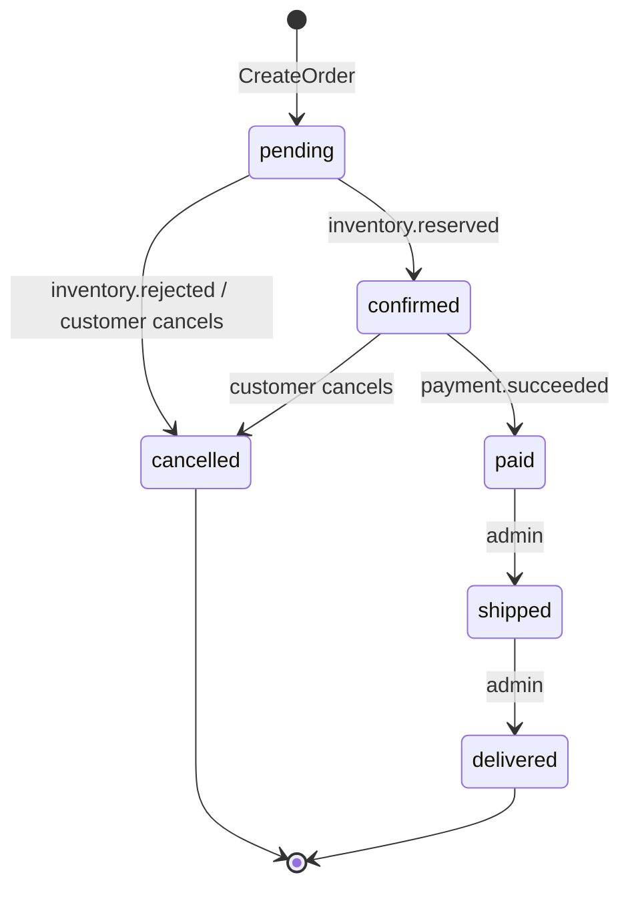

# Architecture and design decisions

This document explains how the services work together, which guarantees the
system gives, and the trade-offs behind them. The [README](../README.md) has
the overview and the quick start.

- [Service boundaries](#service-boundaries)
- [Communication](#communication)
- [Order saga](#order-saga)
- [Event delivery guarantees](#event-delivery-guarantees)
- [Concurrency control](#concurrency-control)
- [Security](#security)
- [Caching](#caching)
- [Observability](#observability)
- [Decisions](#decisions)
- [Known limitations and roadmap](#known-limitations-and-roadmap)

## Service boundaries

Each service owns its data. There are seven PostgreSQL databases, each owned
by its own role ([`deploy/postgres/init.sql`](../deploy/postgres/init.sql)),
so one service cannot query another's tables. Data that another service needs
reaches it through an API call or an event:

| Data | Owner | Read by others through |
|---|---|---|
| Prices, product names | product-service | `BatchGetProducts` (order-service), `GetProduct` (gateway) |
| Stock | inventory-service | `GetStock` (gateway, composed into `GET /products/{id}`) |
| Orders and their totals | order-service | `GetOrder` (payment-service, gateway) |
| Rating averages | product-service, built from `review.*` events | `GetProduct` |

The gateway contains no business rules apart from authorization. It
authenticates the caller, takes the user ID from the token (never from the
request), checks resource ownership and translates between JSON and gRPC.

## Communication

**Synchronous gRPC** is used when the caller needs an answer to continue:
pricing an order, loading the order to pay, validating a token. Every call has
a deadline. If the catalog cannot be reached, the order is rejected with
`UNAVAILABLE`. It never falls back to a price sent by the client.

**Asynchronous Kafka events** are used when other services need to react to a
change. Topics are per aggregate (`orders`, `inventory`, `payments`,
`products`, `reviews`) and messages are keyed by the aggregate ID. Kafka only
guarantees ordering within a partition, so this keying is what guarantees that
`order.created` is processed before `order.cancelled` for the same order.

Every message uses the same envelope ([`pkg/events/event.go`](../pkg/events/event.go)):

```json
{ "id": "uuid", "type": "order.created", "occurred_at": "…", "data": { … } }
```

The payload types are defined once in [`pkg/events/contracts.go`](../pkg/events/contracts.go).

## Order saga

The saga is a choreography: there is no central orchestrator, each service
reacts to events.



The transitions are a table in
[`order-service/internal/order/status.go`](../order-service/internal/order/status.go)
and every status change goes through `CanTransition`. A transition locks the
order row (`SELECT … FOR UPDATE`), so concurrent events and API calls for the
same order are serialized.

| Step | Service | Local transaction | Emits |
|---|---|---|---|
| Place order | order | insert order (`pending`) and its items, priced from the catalog | `order.created` |
| Reserve stock | inventory | lock stock rows, then reserve all items or none | `inventory.reserved` / `inventory.rejected` |
| Confirm or reject | order | `pending → confirmed` or `pending → cancelled` | – |
| Pay | payment | claim the order, charge the provider, record the result | `payment.succeeded` / `payment.failed` |
| Complete | order, inventory | `confirmed → paid`; reserved units become sold | – |

**Compensation.** When a customer cancels a `pending` or `confirmed` order,
order-service emits `order.cancelled` and inventory-service releases the held
units. If stock is insufficient, inventory-service emits `inventory.rejected`
and the order is cancelled with the reason. A failed payment leaves the order
`confirmed`, so the customer can retry.

**Late events.** Suppose an event no longer applies, for example stock
reserved for an order the customer had already cancelled. order-service
acknowledges and ignores it. Because both events are keyed by the order ID,
inventory-service has already received `order.cancelled` and released the
units.

## Event delivery guarantees

The system aims for **at-least-once delivery with idempotent processing**,
which behaves like exactly-once from the database's point of view.

1. **Transactional outbox** ([`pkg/events/outbox.go`](../pkg/events/outbox.go)).
   A service never publishes to Kafka directly. It inserts the event into an
   `outbox_messages` table in the same transaction as the state change. If
   the transaction rolls back, the event disappears with it, so no event is
   ever published for a change that didn't happen.
2. **Relay.** A background loop publishes unpublished rows in order and marks
   them as published. It uses `FOR UPDATE SKIP LOCKED`, so several replicas can
   run it safely. If Kafka is down, the rows wait and are published later. If
   the process crashes after publishing but before marking the rows, they are
   published again. That is the "at least once" part.
3. **Idempotent consumers** ([`pkg/events/consumer.go`](../pkg/events/consumer.go)).
   `ProcessOnce` inserts `(event_id, consumer)` into `processed_events` in the
   same transaction as the handler's changes. A redelivered event finds its
   row and is skipped. Kafka offsets are committed only after the handler
   succeeded.
4. **Retries and dead letters.** A failing handler is retried 3 times with
   exponential backoff. Then the message goes to `<topic>.dlq` (visible in
   Kafka UI) and is counted in `events_consumed_total{result="dead_lettered"}`,
   so a single bad message cannot block a partition.

## Concurrency control

| Problem | Solution | Test |
|---|---|---|
| Overselling when many customers buy the last units | Stock rows are locked with `SELECT … FOR UPDATE` before checking and updating. A `CHECK (available >= 0)` constraint backs this up | `TestReserve_NoOversellUnderConcurrency` |
| Deadlocks between orders containing the same products | Items are merged and locked in ascending `product_id` order | `TestReserve_NoDeadlockWithOverlappingOrders` |
| Half-reserved orders | All items are checked before any row is modified, inside one transaction | `TestReserve_AllOrNothing` |
| Double charging from double clicks or retries | Partial unique index: at most one `pending` or `succeeded` payment per order. The order is claimed before the provider is called | `TestProcessPayment_ConcurrentAttemptsChargeOnce` |
| Lost cart updates | Atomic upsert (`INSERT … ON CONFLICT DO UPDATE SET quantity = quantity + excluded.quantity`) | `TestCartOperations` |

## Security

- **Authentication.** auth-service issues HS256 JWTs (`sub`, `role`, `iss`,
  `exp`, secret ≥ 32 bytes). The gateway validates every protected request
  through `ValidateToken`, which accepts only HS256 tokens with the expected
  issuer and an expiry.
- **Authorization.** Admin-only routes use `RequireRole("admin")`. User
  resources use the user ID from the token. Orders of other users return
  `404`, so order IDs cannot be probed. payment-service checks ownership again
  instead of trusting the gateway. review-service enforces "author or admin"
  for deletions.
- **Values the client cannot set.** The order request has no price field
  (extra JSON fields are ignored). The payment request has no amount field.
  The user ID in request bodies is ignored.
- **Accounts.** bcrypt password hashes. Unknown usernames and wrong passwords
  get the same error and take the same time (a dummy hash comparison), which
  prevents account enumeration. Verification codes come from `crypto/rand`,
  expire after 15 minutes and allow 5 attempts. Auth endpoints are
  rate-limited per IP.
- **Errors.** Internal errors are logged with the request ID and returned as
  a generic `internal error`.
- **Containers** run as a non-root user on distroless images.

## Caching

Cache-aside with explicit invalidation, used for read-heavy data owned by a
single service:

- `product:{id}` (5 min TTL), invalidated on update, delete and rating changes.
- `cart:{userId}` (10 min TTL), rewritten after every change.

Redis is treated as optional during reads: a cache error is a cache miss, and
PostgreSQL stays the source of truth.

## Observability

- **Logs.** JSON via `log/slog`, one line per HTTP request and per RPC. The
  gateway assigns an `X-Request-ID` (or keeps the client's) and forwards it as
  gRPC metadata, so one `grep` follows a request across services.
- **Metrics.** The gateway exposes `http_requests_total` and
  `http_request_duration_seconds` per route template. Each service exposes
  `grpc_server_*` metrics, `events_published_total` and
  `events_consumed_total` on `:9100/metrics`.
- **Dashboard.** Grafana is provisioned with
  [`deploy/grafana/dashboards/overview.json`](../deploy/grafana/dashboards/overview.json)
  (traffic, latency percentiles, errors by gRPC code, event throughput,
  dead letters).
- **Health.** Each binary supports `healthcheck` as a subcommand: a gRPC
  health check for services, `GET /healthz` for the gateway. Docker uses it
  because the distroless image has no shell or curl.

## Decisions

| Decision | Why | Trade-off |
|---|---|---|
| One Go module, one directory per service | One `go.mod` keeps dependency versions consistent and removes `replace` directives. Services are still separate binaries and images, and only talk through gRPC contracts and events | Separately versioned modules would need extra tooling |
| gRPC inside, REST outside | Typed contracts and code generation between services; a familiar JSON API for clients | Gateway mapping code (`dto.go`) |
| Choreography instead of an orchestrator | Few steps, no extra component, each service stays autonomous | The flow is spread across services; this document and the state machine make it explicit |
| Outbox instead of publishing after commit | A crash between the commit and the publish cannot lose an event | A relay loop and a little extra latency (polls every 200 ms) |
| `segmentio/kafka-go` | Pure Go, no CGO: static binaries on distroless images | Fewer features than librdkafka |
| Money as `int64` cents | No floating-point rounding errors | Clients format amounts themselves |
| GORM `AutoMigrate` | Keeps the focus on the distributed parts | Not suitable for production schema changes (see roadmap) |
| Verification email stubbed by `LogMailer` | Keeps the demo self-contained behind a `Mailer` interface | No real email delivery |
| Simulated payment provider | Deterministic tests (cards ending in `0002` are declined) behind a `Provider` interface | No real payment integration |

## Known limitations and roadmap

These are deliberate scope limits, not oversights:

- **Payment and cancel race.** If a customer cancels during the
  milliseconds between the payment's status check and the charge, the order
  can be cancelled after being charged. A refund flow (`payment.refunded`) or
  an order-side reservation of the payment step would close this.
- **Stuck `pending` payments.** A crash between claiming the order and
  recording the result leaves a `pending` payment. Production systems run a
  reconciliation job against the provider.
- **Refunds and returns** are not implemented. Paid orders cannot be
  cancelled.
- **Distributed tracing** (OpenTelemetry) would complement the request-ID
  correlation.
- **Schema migrations** should use a versioned tool (golang-migrate, Atlas)
  instead of `AutoMigrate`.
- **Token revocation.** Tokens are valid until they expire. Short-lived
  access tokens plus refresh tokens would be the next step.
- **Rate limiting** is in memory, per gateway instance. With several replicas
  it would move to Redis.
- **TLS/mTLS** between services and **Kubernetes manifests** are out of scope
  for a local Docker Compose setup.
